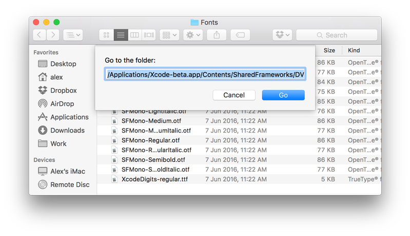
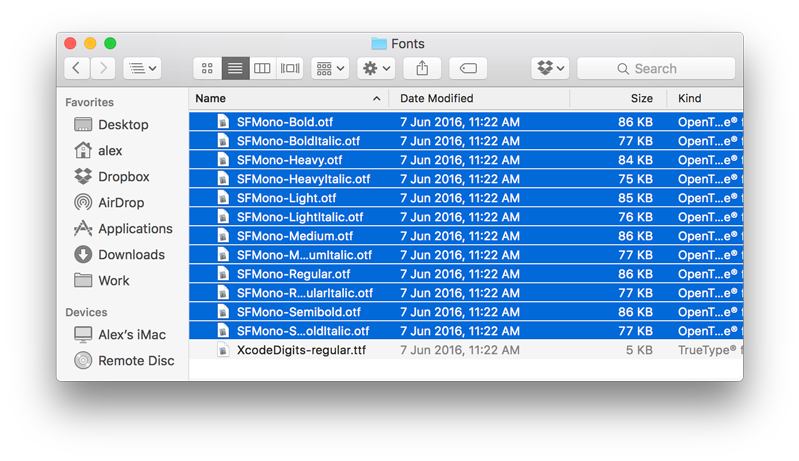
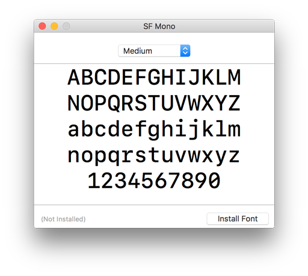

Apple's new San Francisco Mono typeface comes bundled in with the latest Xcode 8 beta, and it's beautiful! If you're impatient like me and want to use San Francisco Mono in your other apps before macOS Sierra is released, you can grab its `otf` files from the Xcode 8 Beta app package and install them manually:

1. [Download and install the Xcode 8 beta](https://developer.apple.com/download/) (you'll need an Apple Developer account)
1. Open Finder and push `CMD + SHIFT + G` to open the "Go to Folder dialog", then paste this path (its prefix may differ depending on where you installed Xcode):
  `/Applications/Xcode-beta.app/Contents/SharedFrameworks/DVTKit.framework/Versions/A/Resources/Fonts`
  
1. Open all the font files starting with "SFMono":
  
1. Choose "Install Font":
  

The San Francisco Mono fonts should now be available to use throughout your entire system. Enjoy!
