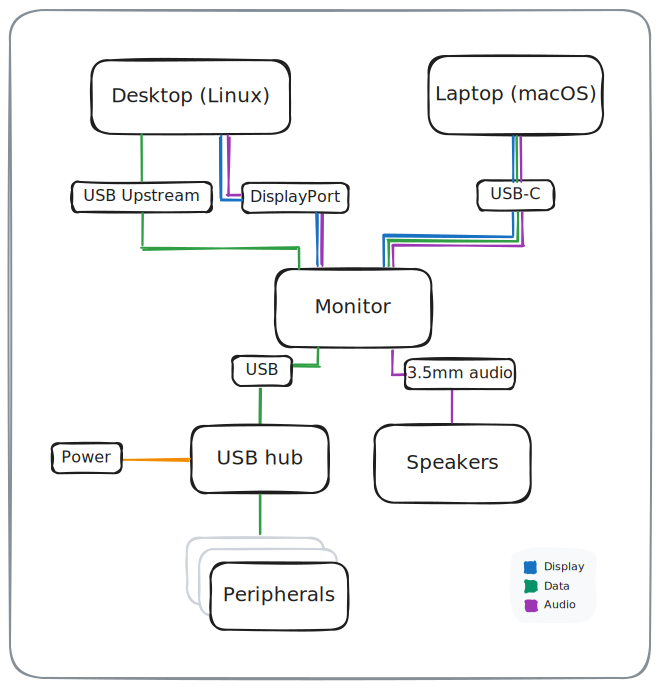
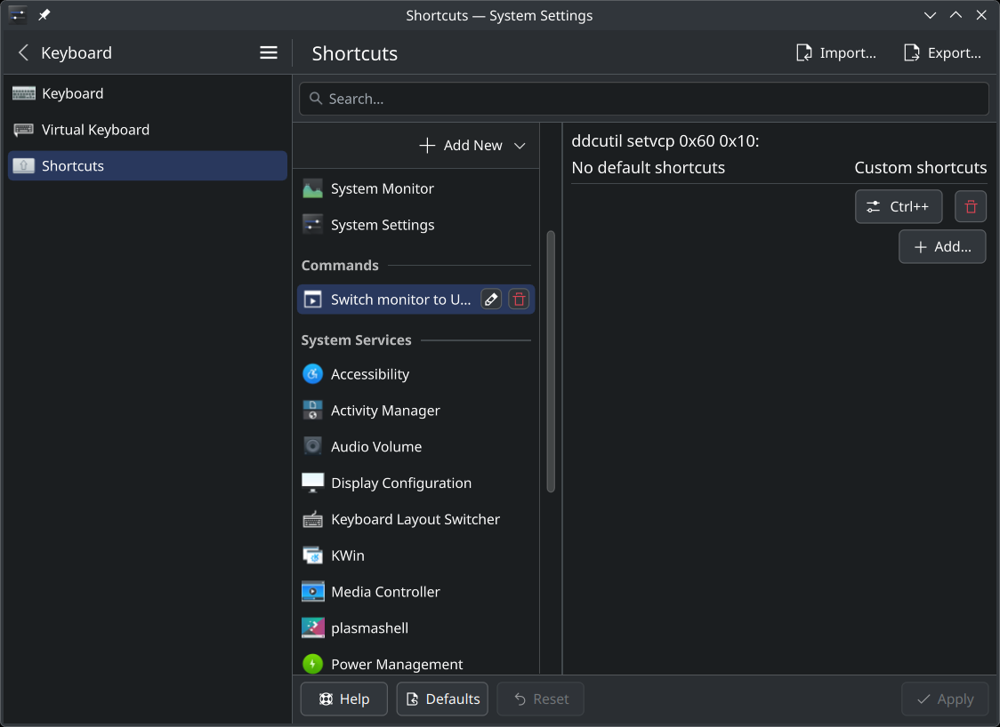

+++
date = '2025-08-16T00:00:00Z'
title = 'Two computers, one monitor, zero fiddling'
description = 'How to switch inputs between desktop and laptop on one monitor using built-in KVM and DDC'
image = 'cover.jpg'
tags = ['Tools', 'CLI']
+++

I've got a Mac laptop and Linux desktop, and use the same keyboard, mouse, and monitor for both. If you also work from home, I'm sure you can relate... laptop for work, desktop for hobby... but only one monitor and peripherals.

Switching between the two machines has always been a pain. It requires either fiddling around with plugging and unplugging cables at the back of the monitor, using flaky USB-C switches, or annoying dongles.

With a recent upgrade of my monitor I wanted to solve this problem for good; I wanted to be able to switch between the two machines very quickly, without any fiddling. In fact, even lifting my hands off the keyboard would be considered failure.

Well, I've done it. Behold:

<video alt="video demonstrating switching between inputs using a keyboard shortcut" src="demo.mp4" controls="yes"></video>

A couple of things have made this possible:

1. Getting a monitor with KVM ([keyboard, video, mouse](https://en.wikipedia.org/wiki/KVM_switch)) functionality built in, so I can plug USB inputs into it and have them follow whatever the active input source is, and...
2. Using DDC ([Display Data Channel](https://en.wikipedia.org/wiki/Display_Data_Channel)) commands to control the monitor via its HDMI/DP cable.

Let's go into these one by one...

## The monitor

I won't bury the lede. It's the [MSI MPG 321URX](https://amzn.to/4fLX7yj) (affiliate link). The main draw of this thing is its absolutely beautiful QLED panel that runs 4K at 240 Hz. Good for programming, good for gaming.

(A [newer version of this monitor](https://amzn.to/4lvLNaF) is out now — what I'm describing should work the same for it too).

Other manufacturers like Samsung and Alienware also ship monitors with the same gorgeous panel, but the MSI is cheaper. I also appreciate that it relegates its gamer aesthetics to the back of the monitor, where only my wall has to see them. Sorry wall.

I use two inputs on the monitor:

- **USB-C**: MacBook on macOS
- **DisplayPort**: Desktop on Linux

For plugging in peripherals, the monitor's also got a couple of USB ports, and a 3.5 mm audio jack. I use a USB hub to one of the ports to increase the number of available ports:



In reality the back of my monitor is a lot messier than the straight lines in that diagram would have you believe, but it's only my wall that gets to see that. Sorry again wall.

The thing that makes this setup work so well is the monitor's built-in KVM feature, which lets data from the USB ports follow the active input. So when I'm using my laptop via USB-C, the monitor's built-in USB hub flows through USB-C, but when I'm on my desktop via DisplayPort, the USB hub goes through the USB-A connection to my desktop.

To switch between the two inputs I could reach over and fiddle with the monitor's controls, but like I said... moving hands away from the keyboard is failure, and we won't stand for that!

## Display Data Channel (DDC)

Enter DDC — which can be used to send instructions to a modern monitor via its display cable (HDMI, USB-C, DisplayPort). We can use this to tell the monitor to do things like change volume, adjust brightness and contrast, and crucially for me, change to a specified input. Without ever touching it!

Command line programs let you send commands across DDC to your monitor, and depending on your OS, different shims can be used to bind those to a keyboard shortcut.

### macOS

On macOS with a machine running Apple Silicon we can send monitor DDC signals with [m1ddc](https://github.com/waydabber/m1ddc). If you're running an Intel chip there are alternatives.

Here are some example commands you can run:

```sh
brew install m1ddc # install the thing
m1ddc display list # list your connected monitors
m1ddc display <id_from_prev_command> chg volume 100 # change volume
m1ddc display <id_from_prev_command> set input <input_to_switch_to> # switch inputs
```

[m1ddc's README](https://github.com/waydabber/m1ddc) contains a list of input codes. In my case, DisplayPort is input code `15` and my monitor's ID is `381C72C8-0CDA-4B71-A1CD-F8AFE90AB0ED`, so this incantation switches to DisplayPort:

```sh
m1ddc display 381C72C8-0CDA-4B71-A1CD-F8AFE90AB0ED set input 15
```

With the m1ddc command ready to go, I use [Hammerspoon](https://www.hammerspoon.org/) to bind it to `CTRL + SHIFT + =`:

```lua
-- Somewhere in ~/.hammerspoon/init.lua

-- Sends a DDC code to my MSI MPG 321URX that will switch to DisplayPort input.
hs.hotkey.bind({ "ctrl", "shift" }, "=", function()
  local display_id = "" -- figure this out by running 'm1ddc display list'
  local displayport_code = "15" -- input codes listed on m1ddc's readme
  local command = "/opt/homebrew/bin/m1ddc display " .. display_id .. " set input " .. displayport_code
  hs.execute(command)
end)
```

Then, on the Linux end I bind the same keyboard shortcut to switch back to USB-C:

### Linux (KDE desktop environment)

On Linux I've had luck with using [ddcutil](https://www.ddcutil.com/) for controlling the monitor.

```sh
sudo pacman -Suy ddcutil # install with your package manager
ddcutil detect # list monitors connected to your machine
```

ddcutil is not as user friendly as m1ddc. You'll have to figure out the code of the setting you want to modify (e.g. input, volume, brightness) and then set the value accordingly. Luckily ddcutil makes these easy to discover. So, in my case:

```sh
ddcutil capabilities
```

```text
...
   Feature: 60 (Input Source)
      Values:
         11: HDMI-1
         12: HDMI-2
         0f: DisplayPort-1
         10: DisplayPort-2
...
```

The “input” setting is Feature 60, so that's what we need to modify to change inputs. As for the value, a bunch of options are listed but no USB-C! The monitor only has two HDMI ports, one DisplayPort, and one USB-C port, so by process of deduction we can assume the second “DisplayPort” there is actually the USB-C port. It likely identifies as DisplayPort because USB-C is running in DisplayPort Alt Mode.

So with that figured out, the command we can run to change input to USB-C is:

```sh
ddcutil setvcp 0x60 0x10
```

Unlike with m1ddc, I haven't bothered specifying which display to run it on, since I only have one display connected to my desktop (whereas the laptop also has its own built-in display). If you use multiple screens, you'll have to adapt these commands accordingly.

Since I use the KDE desktop, the easiest way to bind the `CTRL + SHIFT + =` shortcut there is via the built-in shortcuts manager:



Simple! Push the keys: run ddcutil!

### Windows

You can also configure this on Windows. I haven't tried it myself, but the Windows program MSI ships for controlling the monitor seems to let you assign actions to keyboard shortcuts... so you might be able to get it to change inputs without even having to invoke a separate CLI program!

## Conclusion

And there you have it. A KVM solution that doesn't require an external KVM device to pass inputs through, and a switch that can be triggered using a keyboard alone.

Thanks for reading! DDC you later.
