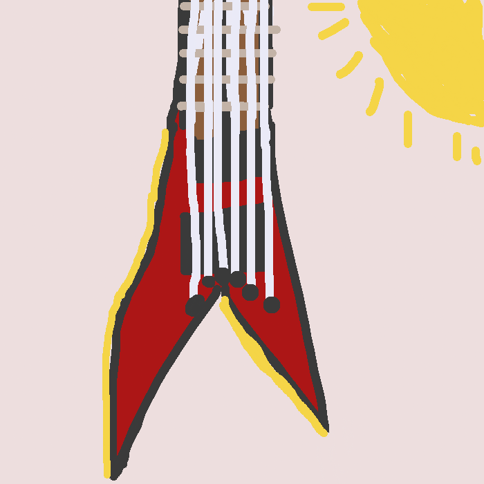
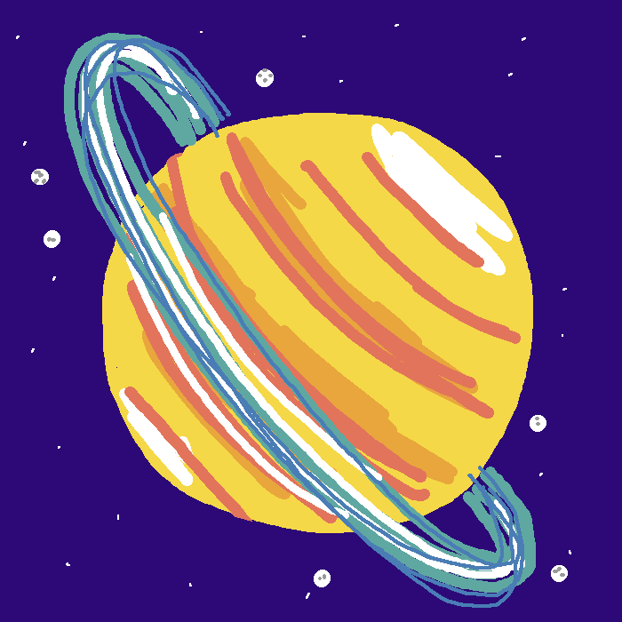

+++
date = '2026-07-07T12:00:00+1000'
title = 'bigdraw: I made a collaborative drawing site'
description = 'Announcing bigdraw.party: a collaborative drawing grid where strangers claim tiles, draw whatever they like, and turn a big empty grid into a weird little shared place on the internet.'
image = 'grid.png'
tags = ['Web']
+++

Here's a little thing I've been building over the past few weeks: <a href="https://bigdraw.party" target="_blank"><strong>bigdraw.party</strong></a>.

It's a big grid made up of little drawings that anyone can add to. No logins required (or drawing skills, for that matter):

<!--more-->

<a href="https://bigdraw.party" class="block" target="_blank">

</a>

To add to the grid, claim a free tile and draw using basic tools (think MS Paint). Here are some examples closer up (click to jump to them in bigdraw):

  
  
  

Since every drawing gets its own permanent spot, strangers can extend them, surround them, or find other ways to respond - which turns the grid into a shared place. Or you can wander far away and draw something in a lonesome spot, to be stumbled on by someone later... or never.

Some of my favourite times on the internet have been on websites that make you feel connected with complete strangers, and I'm hoping to recreate some of that magic with bigdraw.

## Building it, in a nutshell

Building this came with some fun learnings and challenges. I'll run through some of the interesting parts at a high level, but will leave deep dives for future more focused posts.

### Backend

The backend is a Go service with a SQLite store. It's responsible for serving up the images, the grid metadata, and for accepting new submissions.

You can zoom out pretty far in bigdraw, and that's where a lot of the fun starts... on my Macbook Air if I zoom as far as I can, I see ~45,000 tiles in my viewport. And that's on a small screen. The bigger the screen, the more tiles that can fit.

Here's a viewport filled with test images so you can see what I mean. Each one of those little squares represents a 700x700px drawing. Watch the video to see a zoom from far to near:

<video class="w-full mx-auto rounded" controls="true" muted="true" playsinline poster="zoom-demo-poster.jpg">
  <source src="zoom-demo.mp4" type="video/mp4">
  Your browser does not support the video tag.
</video>

This zoomed out view makes the grid feel more like a place and less like an image gallery. From the high vantage point you can see clusters forming, empty regions waiting to be claimed, and where people are drawing at any given time.

But if each tile was represented as an image, that'd be 45,000 images per screen - I don't know about your connection speed but mine can't handle that.

To make this performant I use <a href="https://en.wikipedia.org/wiki/Tiled_web_map" target="_blank">tile maps</a> (as seen in your favourite map app) and construct a tile pyramid at increasing powers of two. So when you're zoomed right in, one image is one tile, zoom out a bit further and one image becomes 4 tiles, then 16, 64... up to 16,384 tiles per image at the farthest zoom level.

Then there's the metadata associated with each tile which helps answer questions like "is the tile being drawn on right now?" This starts from a fine level of detail when you're zoomed in and gets coarser as you zoom out. The coarse representation is a bitset where 0 = unclaimed, 1 = claimed. For 45,000 tiles that's 45,000 bits = 5.6kB to represent claims on all visible tiles. This kind of representation compresses easily, so the net result is a much smaller payload pushed over the wire.

The tiles and metadata are returned in chunks and cached at the edge (Cloudflare) with a very short TTL. This means that the server doesn't have to get hammered too hard if multiple requests are coming in for the same chunk at the same time. The tradeoff is that the viewport can lag behind the changes being made by a few seconds, but this is well worth it considering the implementation simplicity it leads to.

### Frontend

The frontend is plain old JavaScript using native web APIs. The grid and drawings get rendered onto a 2D <a href="https://developer.mozilla.org/en-US/docs/Web/API/Canvas_API" target="_blank">Canvas</a>, which has got two main modes:

**Panning mode**, where you can zoom and pan around the grid. For this, images are loaded on the fly and smoothly interpolated between zoom levels. Per the video above you can start from the furthest away spot and zoom in to the closest - without perceiving that the underlying images are being swapped out.

The tiled web maps also lend themselves to high DPI screens, since for any given viewport if we want a higher pixel density image, we can just request the finer zoom level. This does lead to more requests and processing on high DPI screens, but typically those screens are attached to faster computers anyway so the actual impact is imperceptible. I tested bigdraw on the cheapest phone I could find at my local Officeworks and it performed well.

And then there's **drawing mode**, where you can draw on your tile :) This was heavily inspired by the <a href="https://jspaint.app/" target="_blank">JSPaint</a> reimplementation of MS Paint, as I wanted to capture the feel of oldschool digital brushes.

Your brush dabs (excuse me while I show off my newly learned painting terminology) are drawn to a 700x700px
<a href="https://developer.mozilla.org/en-US/docs/Web/API/OffscreenCanvas" target="_blank">`OffscreenCanvas`</a>
that's then projected onto the visible canvas. Keeping two canvases in memory and in sync is inefficient, however it simplifies implementation a lot: if you pan and zoom while drawing, then the offscreen canvas can be projected at a different coordinate/dimension without needing to do tricky maths, and then when you submit it the output becomes a 1:1 mapping of the canvas pixels to the final image.

There are also some basic UI controls in bigdraw (toolbars, modals, etc) which manage DOM element lifecycles.
This part of the codebase is particularly distressing to look at since it writes `innerHTML` directly and binds to DOM nodes manually, but so far this procedural approach has worked, and I'm not convinced it's time to wrap it up in a framework just yet.
Especially considering that the plain JavaScript approach produces a 47kB gzipped bundle for the entire site, whereas React + React DOM _on their own_ weigh in at 60kB.

## Conclusion

I'll probably expand on the implementation details in future posts - there's more to talk about both depth and breadth wise. Let me know if there's something in particular you're interested in learning more about!

Thanks for reading, and I hope to see you on <a href="https://bigdraw.party" target="_blank">bigdraw.party</a>.

<a href="https://bigdraw.party/tile/2500/2500" class="block w-fit mx-auto" target="_blank">

</a>
